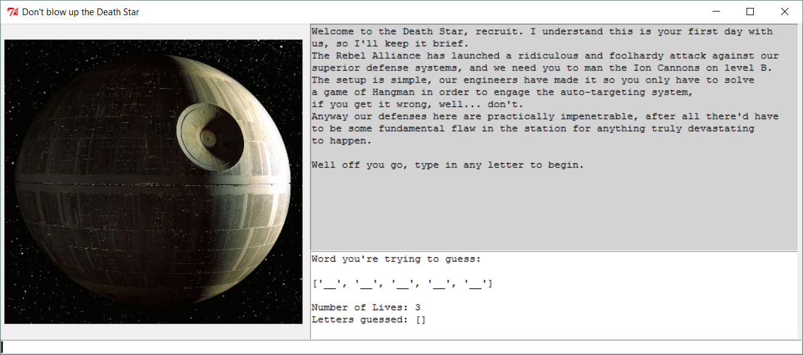
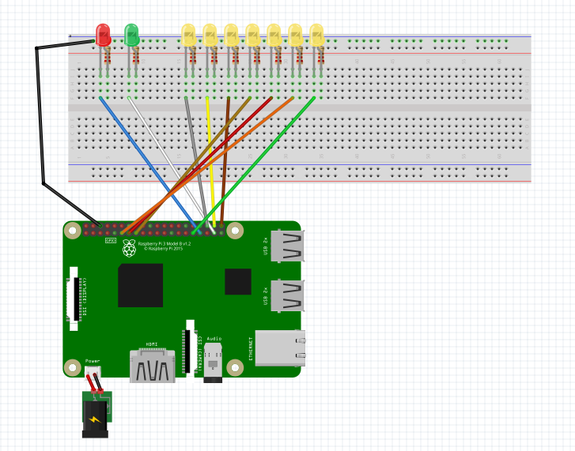

# Cyberstorm-Final-Project-CYEN132
Final project for our cyber/cs class    
Theme of Cyberstorm is Constellation   
Parameters for the project: It must use GPIO with Rpi, Python, and be a puzzle.    
Team Members: Andre Aguillard, Rylan Burlison, Dax Henson

### Project Overview: 
  We created a game of hangman using python, a GUI, and the Raspberry Pi’s GPIO pins. The pins trigger various LED’s on a breadboard. A green one lights up if a letter is in the word, and a red one lights up if the letter is wrong. Additionally, there is a line of 7 LEDs that display the number of lives or incorrect guesses left. This line is originally all lit up, but an LED turns off after an incorrect guess is made. The GUI displays a picture of the Death Star which gradually progresses to its demise on account of incorrect guesses, underneath of which is an entry space to input letters, and next to those are two labels one displays the letters that one guessed, the number of lives left, and the correct letters in their blanks, the other displays instructions and hints. The goal of the game is to guess the correct word, before the Death Star blows up. If the user guesses the word correctly, a popup window appears prompting that user to choose the next word for the subsequent player to guess. The challenge was deployed at Cyberstorm with 5 out of 8 teams completeing the challenge. Each successful team was able to set the word for the opponent who followed them. 

### Clarity on the code above:
  The Final Project.py is our final piece of code to submit. 
  The Final Project Non-pi.py is the version which doesn't require GPIO or Raspberry Pi use.
  The GUI.py is the code for the GUI     
  The other .py files are places to work on the code.    

### Screenshots:

GUI Home screen:

Circuit Layout Note, we used a GPIO breakout to link the Raspberry Pi to the Breadboard

